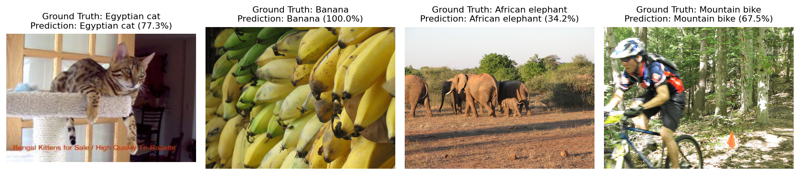
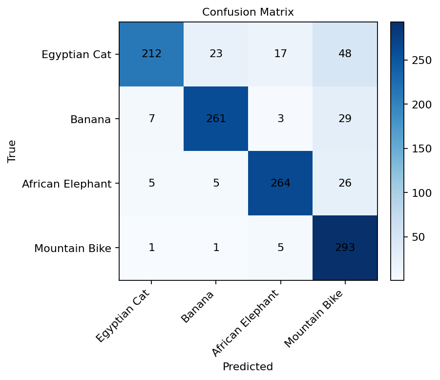

# ece595
Repository for MS Autonomy ECE59500CV

Project Archives: https://drive.google.com/drive/folders/1UUPBdLMmMBIj3a8dw_dFwxBuVDol618I?usp=drive_link

## Final Project: ConvNeXt Critique and CIFAR-10 Implementation

The final project is the main artifact in this repository. It combines a literature-style critique of three recent CVPR papers with a PyTorch implementation and ablation study of a ConvNeXt-Tiny-inspired image classifier on CIFAR-10.

The project studies:

- **ConvNeXt: A ConvNet for the 2020s (CVPR 2022)** - the implementation focus, used to study how transformer-era design choices translate back into convolutional networks.
- **UniAD: Planning-oriented Autonomous Driving (CVPR 2023)** - reviewed as a system-level example of planning-oriented perception, prediction, and control.
- **Reasoning in Visual Navigation of End-to-End Trained Agents (CVPR 2025)** - reviewed for its dynamical-systems perspective on learned visual navigation policies.

### Final Project Implementation

The implemented portion focuses on ConvNeXt. It builds a ConvNeXt-Tiny-like model from scratch in PyTorch and compares it against a ResNet-18 baseline on CIFAR-10. The code exposes the major architectural choices as command-line flags so they can be evaluated independently:

- Depthwise convolution kernel size: `3x3` vs `7x7`
- Normalization: `LayerNorm` vs `BatchNorm`
- MLP expansion ratio: `2`, `4`, or `6`
- Input stem: ConvNeXt-style `4x4` patchify stem vs ResNet-style `7x7 + max-pool` stem
- Baseline model: `torchvision` ResNet-18

Key files:

```text
paper/
  train_cifar10.py        # CIFAR-10 training/evaluation entrypoint
  models/convnext.py      # ConvNeXt-Tiny-like model and ablation knobs
  run_exps.sh             # Experiment sweep driver
  plot_results.py         # Log aggregation and plot generation
  requirements.txt        # Final project Python dependencies
  LaTeX/                  # CVPR-style paper source
```

Architecture and experiment flow:


### Final Project Results

The final report and presentation show that ConvNeXt's ImageNet-scale design choices do not transfer uniformly to low-resolution CIFAR-10. ResNet-18 remains the strongest baseline, while ConvNeXt benefits most from a more traditional ResNet-style input stem.

| Configuration | Best Validation Accuracy |
| --- | ---: |
| ResNet-18 | 84.95% |
| ConvNeXt-Tiny, patchify stem, `k=7`, LayerNorm, MLP x4 | 72.93% |
| ConvNeXt-Tiny, patchify stem, `k=3`, LayerNorm, MLP x4 | 73.18% |
| ConvNeXt-Tiny, patchify stem, `k=7`, BatchNorm, MLP x4 | 70.56% |
| ConvNeXt-Tiny, patchify stem, `k=7`, LayerNorm, MLP x2 | 71.42% |
| ConvNeXt-Tiny, patchify stem, `k=7`, LayerNorm, MLP x6 | 71.44% |
| ConvNeXt-Tiny, ResNet-style stem, `k=7`, LayerNorm, MLP x4 | 79.90% |

Main takeaways:

- ConvNeXt's modernization ideas are useful, but scale and image resolution matter.
- The large `7x7` depthwise kernel is not clearly beneficial on CIFAR-10; `3x3` performs slightly better in this setup.
- LayerNorm is more stable than BatchNorm inside the ConvNeXt blocks tested here.
- The original MLP expansion ratio of `4` is the best among the tested ratios.
- Replacing the patchify stem with a ResNet-style stem substantially improves ConvNeXt on CIFAR-10, suggesting early low-level feature extraction is especially important for small images.

### Running the Final Project

From the `paper/` directory:

```bash
pip install -r requirements.txt

python train_cifar10.py \
  --model convnext_tiny \
  --data-dir ./data \
  --epochs 50 \
  --batch-size 128 \
  --kernel-size 7 \
  --norm-layer ln \
  --mlp-ratio 4 \
  --stem-type patchify
```

To run the included ablation sweep:

```bash
bash run_exps.sh
```

Training writes CSV logs to `paper/results/` and checkpoints to `paper/checkpoints/`. The plotting helper reads the logged results and generates comparison figures.

## Other Repository Contents

### HW1: Reverse-Mode Autodiff and Toy MLPs

`hw1/` implements a small reverse-mode automatic differentiation system and uses it to train simple MLPs on toy Boolean tasks.

Workflow:


Key pieces:

- `reverse_mode.py` implements the cobundle/tape-based reverse-mode autodiff primitives.
- `mlp.py` defines vector helpers, sigmoid layers, L2 loss, parameter packing, and MLP evaluation.
- `datasets.py` provides XOR and two-bit-adder datasets.
- `splits.py`, `evaluate.py`, and `train_loop.py` provide data splitting, metrics, and gradient descent.
- `train_mlp_xor_demo.py` and `train_mlp_adder_demo.py` run experiments across small model sizes, splits, learning rates, and iteration counts.
- `submission/`, `submission/v2/`, and `submission/tmp/` preserve packaged submission versions, including zipped turn-ins.

Run:

```bash
cd hw1
bash run
```

### HW2: SmallNet Image Classifier

`hw2/` contains a compact CNN image classifier for a four-class image dataset: Egyptian cat, banana, African elephant, and mountain bike. The model is intentionally lightweight and VGG-like, with BatchNorm, ReLU activations, max-pooling, a small residual connection in the first block, and an adaptive-pooling classifier head.

Model flow:


Key pieces:

- `models/small_net.py` defines the `SmallNet` architecture.
- `utils/dataset.py` implements the dataset loader, class mapping, resizing/cropping, augmentation, and normalization.
- `train.py`, `test.py`, `inference.py`, and `trace.py` cover training, evaluation, sample inference, and shape/parameter tracing.
- `arch.txt` documents the model blueprint.
- `artifacts/` includes the trained model checkpoint, metrics, confusion matrix, inference grid, and test report.
- `submission/tmp/` preserves the packaged submission copy.

Recorded evaluation artifacts report:

- Top-1 accuracy: `70.08%`
- Top-2 accuracy: `84.58%`
- Test samples: `1200`

Demo outputs already included in the repository:





Run:

```bash
cd hw2
bash run
```

The script installs dependencies, downloads/unzips the Purdue homework dataset if needed, prints the model blueprint, trains the model, evaluates it, and writes outputs into `hw2/artifacts/`.

## Root-Level Files

- `.gitignore` excludes Python caches, environments, generated datasets, and large training artifacts such as `hw2/data/`, `h2-data.zip`, `paper/data/`, and `paper/checkpoints/`.
- `LICENSE` contains the Apache License 2.0.
